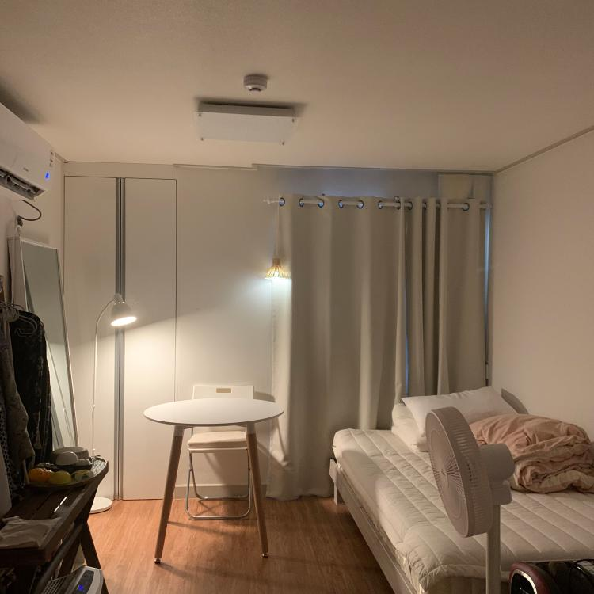
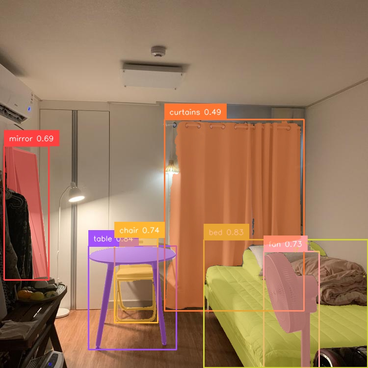

# GroundedSam2

## 개요
우리가 우선적으로 하고자 하는 목표는 이미지로부터 가구를 탐지(Detection)하거나 세분화(Segmentation)하여 라벨링하는 것입니다. 이러한 작업에 적합한 모델로 GroundedSam2을 활용하기로 했습니다.

GroundedSam2는 인터넷급 데이터를 기반으로 학습된 모델을 사용하여 다양한 형태의 가구를 포괄적으로 인식할 수 있다는 장점을 가지고 있습니다. 또한 다양한 프롬프트를 기반으로 정확성을 높이는데, 텍스트 프롬프트와 결합하여 사용자 요구에 따라 유연한 가구 탐지가 가능합니다.

---

## 주요 기능
1. **텍스트 기반 객체 탐지**:
   - **Grounding DINO**를 사용하여 입력된 텍스트 프롬프트에 따라 객체를 탐지합니다.
   - "소파. 책상. 의자."와 같은 간단한 텍스트 입력을 지원하며, 다양한 가구 및 물체를 식별할 수 있습니다.

2. **정확한 이미지 세분화**:
   - SAM2 (Segment Anything Model)을 사용하여 탐지된 객체를 픽셀 단위로 정확히 세분화합니다.
   - Grounding DINO에서 생성된 경계 상자를 바탕으로 세분화 결과를 더욱 정교하게 만듭니다.
---

TEXT_PROMPT = "bed. chair. table. curtains. mirror. fan. "

  
  

